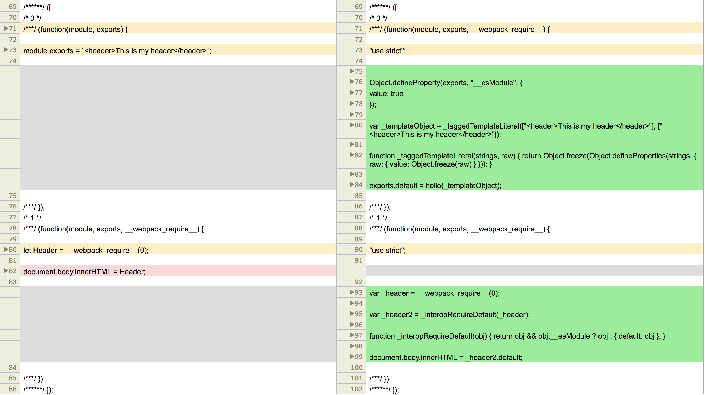

# Learning ES6


## Simple Wepack

```
(function(modules) { // webpackBootstrap
        // The module cache
        var installedModules = {};

        // The require function
        function __webpack_require__(moduleId) {

                // Check if module is in cache
                if (installedModules[moduleId]) {
                        return installedModules[moduleId].exports;
                }
                // Create a new module (and put it into the cache)
                var module = installedModules[moduleId] = {
                        i: moduleId,
                        l: false,
                        exports: {}
                };

                // Execute the module function
                modules[moduleId].call(module.exports, module, module.exports, __webpack_require__);

                // Flag the module as loaded
                module.l = true;

                // Return the exports of the module
                return module.exports;
        }


        // expose the modules object (__webpack_modules__)
        __webpack_require__.m = modules;

        // expose the module cache
        __webpack_require__.c = installedModules;

        // identity function for calling harmony imports with the correct context
        __webpack_require__.i = function(value) {
                return value;
        };

        // define getter function for harmony exports
        __webpack_require__.d = function(exports, name, getter) {
                if (!__webpack_require__.o(exports, name)) {
                        Object.defineProperty(exports, name, {
                                configurable: false,
                                enumerable: true,
                                get: getter
                        });
                }
        };

        // getDefaultExport function for compatibility with non-harmony modules
        __webpack_require__.n = function(module) {
                var getter = module && module.__esModule ?
                        function getDefault() {
                                return module['default'];
                        } :
                        function getModuleExports() {
                                return module;
                        };
                __webpack_require__.d(getter, 'a', getter);
                return getter;
        };

        // Object.prototype.hasOwnProperty.call
        __webpack_require__.o = function(object, property) {
                return Object.prototype.hasOwnProperty.call(object, property);
        };

        // __webpack_public_path__
        __webpack_require__.p = "";

        // Load entry module and return exports
        return __webpack_require__(__webpack_require__.s = 1);
})

([
/* 0 */
        (function(module, __webpack_exports__, __webpack_require__) {

                "use strict";
                /* harmony default export */
                __webpack_exports__["a"] = (`<header>This is my header</header>`);


        }),
/* 1 */
        (function(module, __webpack_exports__, __webpack_require__) {

                "use strict";
                Object.defineProperty(__webpack_exports__, "__esModule", {
                        value: true
                });
                /* harmony import */
                var __WEBPACK_IMPORTED_MODULE_0__components_header_js__ = __webpack_require__(0);


                document.body.innerHTML = __WEBPACK_IMPORTED_MODULE_0__components_header_js__["a" /* default */ ];


        })
]);

```

## How to translate ES6
Install `babel-core`, `babel-loader`, `babel-preset-es2015`
```
 npm install --save-dev babel-core babel-loader babel-preset-es2015
```

## 参数

name        |type                   |description
------------|-----------------------|-----------------------
modules     |function               |模块声明


## properties
### __webpack_require__.m = modules

> 缓存所有的模块声明，通过属性m暴露出来

### __webpack_require__.c = installedModules

> 所有已经安装过的module

所谓`installedModules`他与参数`modules`不是同一个概念

#### 数据结构
##### modules：
它是一个数组，里面存储的是都是函数声明，这些函数的内容就是开发者在单个js文件所写的内容，而函数是有webpack编译过程添加的模式模式化代码，这就是为什么在开发者编写模块的时候并没有 module, exports, __webkit_require__, 但是在运行的时候依然可以调用呢这些对象和函数的原因。

#### installedModules
它是一个Object对象（keyValuePair），每一个key都是一个对象，里面存储着模块相关的信息

name        |type               |description
------------|-------------------|----------------------------
moduleId    |object             |moduleInfo


moduleInfo:

name        |type               |description
------------|-------------------|----------------------------
moduleId    |string             |模块的名称，该名称是modules数组中，模块声明对应数组中的索引
l           |boolean            |模块声明是否已经被加载（运行）过，在运行之后，该属性会被赋值为true
exports     |object             |模块声明运行的产出物，他没有特定的类型，string/object/array等都可以，产出物被cache在在exports属性中，从狭义上来说，exports存储的是真正的模块实例。


### __webpack_require__.p = "";

## ES5 Module vs ES6 Module



## Webpack中的重要函数

### _interopRequireDefault

```
function _interopRequireDefault(obj) {
    if(obj && obj.__esModule) {
        return obj;
    }
    else {
        return { default: obj };
    }
}
```

> es6模块默认有一个default作为输出当前实例，所以如果是__esModule，就直接返回对象，如果不是__esModule就对返回值进行一层包装，添加一个default属性并把当前object作为default的value；

参数

name    |type       |description
--------|-----------|--------------------------
obj     |object     |模块实例

> It has a problem
