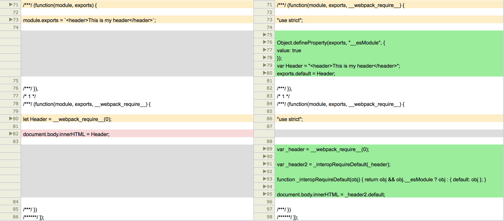

# Learning ES6

## How to translate ES6
ES6截止chrome61仍然有一些功能无法实现，比如class和import class，对于这些缺失以及对于之前的兼容性，`babel`仍然是我们最好的选择。

Install `babel-core`, `babel-loader`, `babel-preset-es2015`
```
 npm install --save-dev babel-core babel-loader babel-preset-es2015

```

### webpack.config.js
```
module.exports = {
    "entry": `${__dirname}./js/main.js`,
    "output": {
        filename: 'bundle.js',
        path: `${__dirname}/dist/`
    },
    module:{
        loaders: [
            {
                test: /\.js$/,
                loader: "babel-loader",
                query: {
                    "presets": ["2015"]
                }
            }
        ]
    }
}
```

## 参数

name        |type                   |description
------------|-----------------------|-----------------------
modules     |function               |模块声明


## properties
### __webpack_require__.m = modules

> 缓存所有的模块声明，通过属性m暴露出来

### __webpack_require__.c = installedModules

> 所有已经安装过的module

所谓`installedModules`他与参数`modules`不是同一个概念

#### 数据结构
##### modules：
它是一个数组，里面存储的是都是函数声明，这些函数的内容就是开发者在单个js文件所写的内容，而函数是有webpack编译过程添加的模式模式化代码，这就是为什么在开发者编写模块的时候并没有 module, exports, __webkit_require__, 但是在运行的时候依然可以调用呢这些对象和函数的原因。

#### installedModules
它是一个Object对象（keyValuePair），每一个key都是一个对象，里面存储着模块相关的信息

name        |type               |description
------------|-------------------|----------------------------
moduleId    |object             |moduleInfo


moduleInfo:

name        |type               |description
------------|-------------------|----------------------------
moduleId    |string             |模块的名称，该名称是modules数组中，模块声明对应数组中的索引
l           |boolean            |模块声明是否已经被加载（运行）过，在运行之后，该属性会被赋值为true
exports     |object             |模块声明运行的产出物，他没有特定的类型，string/object/array等都可以，产出物被cache在在exports属性中，从狭义上来说，exports存储的是真正的模块实例。


### __webpack_require__.p = "";

## ES5 Module vs ES6 Module


从图中可以看到，es5模块，比es6模块中，附加的function要少的多。
es5模块中没有
- _interopRequireDefault
-

## Webpack中的重要函数

### _interopRequireDefault

```
function _interopRequireDefault(obj) {
    if(obj && obj.__esModule) {
        return obj;
    }
    else {
        return { default: obj };
    }
}
```

> es6模块默认有一个default作为输出当前实例，所以如果是__esModule，就直接返回对象，如果不是__esModule就对返回值进行一层包装，添加一个default属性并把当前object作为default的value；

参数

name    |type       |description
--------|-----------|--------------------------
obj     |object     |模块实例


## ES6 class

示例：

```
function(module, exports, __webpack_require__) {
    "use strict";
    Object.defineProperty(exports, "__esModule", {
        value: true
    });
    var _createClass = function() {
        function defineProperties(target, props) {
            for (var i = 0; i < props.length; i++) {
                var descriptor = props[i];
                descriptor.enumerable = descriptor.enumerable || false;
                descriptor.configurable = true;
                if ("value" in descriptor) descriptor.writable = true;
                Object.defineProperty(target, descriptor.key, descriptor);
            }
        }
        return function(Constructor, protoProps, staticProps) {
            if (protoProps) defineProperties(Constructor.prototype, protoProps);
            if (staticProps) defineProperties(Constructor, staticProps);
            return Constructor;
        };
    }();

    function _classCallCheck(instance, Constructor) {
        if (!(instance instanceof Constructor)) {
            throw new TypeError("Cannot call a class as a function");
        }
    }
    var Body = function() {
        function Body(message) {
            _classCallCheck(this, Body);
            this.message = message;
        }
        _createClass(Body, [{
            key: "toString",
            value: function toString() {
                return "<div class=\"body\">" + this.message + "</div>";
            }
        }]);
        return Body;
    }();
    exports.default = Body;
}
```


ES6的class转化成ES5之后会在原本的模块内产生两个新的私有方法

_createClass
> javascript的类别都是由构造函数实现的，createClass就是创建一个构造函数，并将静态属性和方法，以及实例的属性和方法通过Object.defineProperty的方式与构造函数或者实例进行关联。

以下是createClass的具体方法

```
var _createClass = function() {
    function defineProperties(target, props) {
        for (var i = 0; i < props.length; i++) {
            var descriptor = props[i];
            descriptor.enumerable = descriptor.enumerable || false;
            descriptor.configurable = true;
            if ("value" in descriptor) descriptor.writable = true;
            Object.defineProperty(target, descriptor.key, descriptor);
        }
    }
    return function(Constructor, protoProps, staticProps) {
        if (protoProps) defineProperties(Constructor.prototype, protoProps);
        if (staticProps) defineProperties(Constructor, staticProps);
        return Constructor;
    };
}();
```

其中有一些Object.defineProperty的知识需要[普及](./defineProperty.md)一下


_classCallCheck
> 用于验证是否直接把类别当成方法来使用
