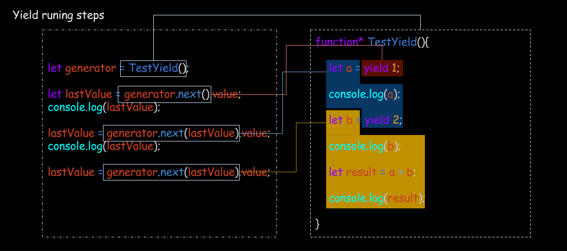

# Generator


## What's Generator?

`Generator`中文意思是生产者，他生产产物是一个可以遍历的对象，而它本身是一个遍历器，在接触它的时候一开始会有一点晕，不过没关系，从晕到不晕本身就是一个从不懂到懂的过程。

首先我们可以参考一下什么如何声明一个`Generator`，它有两个特征
- `function *` 声明一个`Generator`函数；
- `yield` 返回当前的一个状态；

***Example***

```
function * Generator(){
    yield 'aa';
    yield 'bb';
    yield 'cc';
    return 'ending';
}
```

### 作为一个遍历器

遍历器（Iterator）就是这样一种机制。它是一种接口，为各种不同的数据结构提供统一的访问机制。翻译成中文就是，它是一个函数，返回数据结构是统一的。Let's take a look:

遍历器必须在一个对象的`[Symbol.iterator]`上，否则无效，在执行`for(... of)`和`[...a]`这些操作的时候，主要就是在执行[Symbol.iterator]上的遍历器。

***返回值***

name    |value                          |description
--------|-------------------------------|----------------------
next    |{done:false/true,value:xxxx}   |
return  |{done:true}                    |在error，continue，break时触发


***Example***

```
// es6
// 这只是一个例子，不要真实执行，由于done一直是false，所以会一直遍历下去

function () {
    return {
        next(){
            return {
                done: false,
                value:1
            }
        }
    }
}
```

### 作为一个可遍历对象

所谓可遍历对象，简单的说就是在对象上有一个[Symbol.iterator]属性，并且的对应函数必须满足遍历器的要求。

***Example***

```
{
    [Symbol.iterator](){
        return {
            next(){
                return {
                    done: false,
                    value:1
                }
            }
        }
    }
}
```

### Generator的特殊性

- Generator可以作为遍历器
- Generator的返回值是一个可遍历对象

这个特殊性主要归功于Generator的返回值既满足遍历器的条件又满足可遍历对象的条件，Let's take a look：

```
function * Generator(){
    yield 'aa';
    yield 'bb';
    yield 'cc';
    return 'ending';
}

var generator = Generator();

generator[Symbol.iterator]
// ƒ [Symbol.iterator]() { [native code] }

generator.next();
//{value: "aa", done: false}
```

返回值同时有`[Symbol.iterator]`和`next:function(){return {done:false/true,value:xxxx}}`,所以我们作为一个可遍历对象，可以照样玩：

```
generator.next()
```

作为一个遍历函数我们可以这样玩：

```
var iterableObj = {
    0: 1,
    1: 2,
    2: 3,
    length: 3,
    [Symbol.iterator]:Generator
}

console.log([...iterableObj]);

// 两个方法选一个，消费完就完了。
//for(let item in iterableObj)
//    console.log(item)

```

当然我们也可以不使用Generator函数，直接使用他的返回值也是一样的
```
let generator = Generator();

var iterableObj = {
    0: 1,
    1: 2,
    2: 3,
    length: 3,
    [Symbol.iterator](){
        return generator;
    }
}

console.log([...iterableObj]);
```

## yield
`yield`和`Generator`密不可分，因为`yield`只有在`Generator`之内才可以使用。

执行方式：`yield`提供了函数执行的暂停方式，在函数运行的时候，当遇到`yield`之后就暂停之后的操作，并且将紧跟在`yield`的后面的表达式的值，作为`next`方法返回对象`value`的属性的值。`yield是`暂停的标志，next是运行接下来逻辑的按钮。`yield`的返回值为空，但是可以通过给next方设置参数来返回上一次yield运行后的值。

> ⚠️ next的第一个参数，就是上一次`yield`继续执行时的值，如果不设置这个参数，`yield`继续执行当时的值为`undefined`;

```
function next (yieldReturnValue){
    ...
}
```

***参数***

name    | type          |descriptioin
--------|---------------|---------------------------
name    |object/any     |上一次`yield`继续执行时的值，如果不设置这个参数，`yield`继续执行当时的值为`undefined`

***Example***

```

function* TestYield(){
    let a = yield 1;
    console.log("test run value a:", a);
    let b = yield 2;
    console.log("test run value b:", b);
    let result = a + b;
    console.log("test run value result:", a);
}
/***this is execute***/
let generator = TestYield();

let lastValue = generator.next().value;
console.log("get last value:", lastValue);
// get last value: 1

lastValue = generator.next(lastValue).value;
// test run value a: 1
console.log("get last value:", lastValue);
get last value: 2

lastValue = generator.next(lastValue).value;
// test run value b: 2
// test run value result: 1

```


