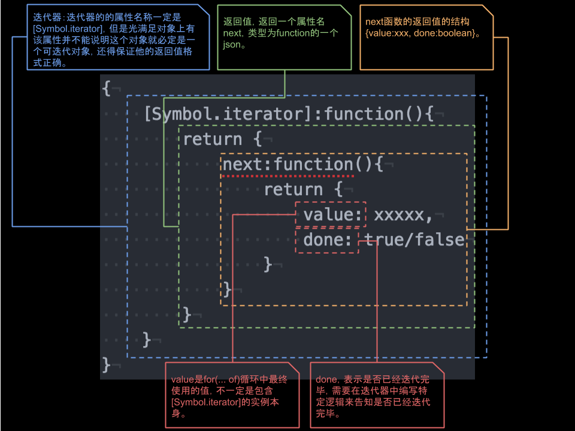

# ES6 iterator

所有可迭代的对象首先需要满足对象上必须有Symbol.iterator的函数，这个函数被称为迭代器

```
{
    [Symbol.iterator]:function(){
        return {
            next:function(){
                return {
                    value: xxxxx,
                    done: true/false
                }
            }
        }
    }
}
```



iterator主要是给for(... of )这种新的循环方式进行消费的

## ES6迭代器ES5化之后的代码

```
for (var _iterator = person[Symbol.iterator](), _step;
        !(_iteratorNormalCompletion = (_step = _iterator.next()).done);
            _iteratorNormalCompletion = true) {
        var item = _step.value;

        console.log(item);
}
```

## Example

### 对于数组的迭代

> 由于数组本身就是可迭代的，这里主要为了演示如何使用`Symbol.iterator`和`迭代器`，才特意创建了Person构造函数

```
!function(){
    var result = [1, 2, 3];
    var index = 0;
    function Person(){
        this[Symbol.iterator] = function() {
            return this;
        };
        this.next = function() {
            if(index < result.length) {
                var returnVal = {
                        value: result[index],
                        done: false
                    };
                index ++;
                return returnVal;
            }
            else{
                return {
                    done: true
                }
            }
        };
    }

    var person = new Person();
    for(var item of person)
    console.log(item);
}();
```

### 对象指针结构的迭代

> 通常情况下，对象指针迭代本身没有太大意义，这里只是提供了一种方案可以实现对象指针结构的迭代，另外阮一峰ES6教程的[Iterator](http://es6.ruanyifeng.com/#docs/iterator)也有相应的例子。

```
!function(){
    function Person(age){
        var current = this;
        current.age = age;
        current[Symbol.iterator] = function () {
            return this;
        };
        current.next = function(){
            if(!!current) {
                var age = current.age;
                current = current.nextPerson;
                return {
                    value: age,
                    done:false
                }
            }
            else {
                return {
                    done:true
                }
            }
        }
    }
    var person1 = new Person(10);
    var person2 = new Person(11);
    var person3 = new Person(12);
    person1.nextPerson = person2;
    person2.nextPerson = person3;
    for(var person of person1) {
        console.log(person);
    }
}();
```

### return

> `Symbol.iterator`返回的除了next之外还有`return`和`throw`，`return`主要是配合，`break`，`continue`，`throw`配合`Generator`使用。

```
!function(){
    let a = {
        0: "hello",
        1: "world",
        length: 2,
        index: 0,
        [Symbol.iterator]: function(){
            var self = this;
            return {
                next: function () {
                    if(self.index < 2) {
                        var value =self[self.index];
                        self.index++;
                        return {
                            value
                        }
                    }
                    else {
                        return {
                            done: true
                        }
                    }
                },
                return: function(){
                    console.log("This is return");
                    return {
                        done: true
                    }
                }
            }
        }
    }
    for(let value of a ){
        console.log(value);
        if(value == "hello") {
            throw new Error();
        }
    }
}();

// hello
// bundle.js:164 This is return
// bundle.js:181 Uncaught Error
// at bundle.js:181
// at Object.<anonymous> (bundle.js:198)
// at __webpack_require__ (bundle.js:20)
// at _defineProperty.0 (bundle.js:66)
// at bundle.js:69

```

> 目前在Chrome Canary 61版本上使用源码（未经过babel转换）测试该功，但是经过babel转换之后，continue的功能没有实现。

> 需要注意的是,正确的使用方法是无条件的使用continue；像下面这种使用方法
```
for(let value of a ){
    if(value == "hello") {
        continue;
    }
}
```
是不会触发return的


## 有哪些地方用到Iterator

> 这里大部分的内容来自于阮一峰的[Iterator](http://es6.ruanyifeng.com/#docs/iterator)的章节,本文所有内容更加偏向于实战

简而言之最多使用在“带...”的场景，所谓的...就是解构、spread、rest参数
