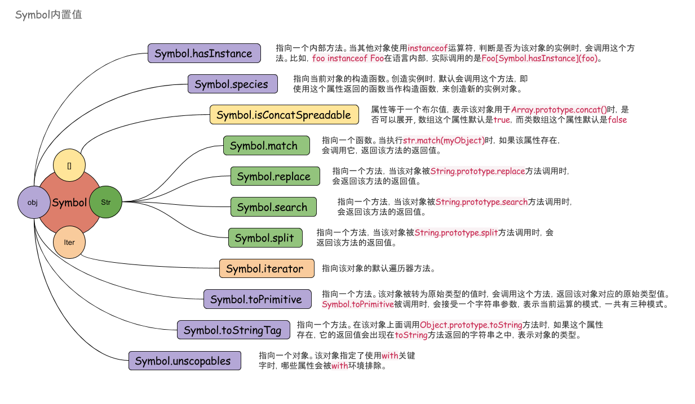

# Symbol

> Symbol是es6新出的一个基础数据类型，前六种是`null`、`undefine`、`number`、`string`、`boolean`、`object`、`function`，Symbol主要用于不希望目前对象有重复的情况

## Symbol()
`Symbol("foo") === Symbol("foo") //false`
> 对于相同的值经过Symbol处理之后也是不一样的。Symbol不能使用 `new Symbol("foo")`，应为Symbol是一个基础数据类型

Symbol的参数可以接受任意数据类型，Symbol的key主要和其参数的toString方法有关，但是对于 `null`、`undefined`、`number`、`string`、`boolean`来说，由于是基础数据类型，`toString`是无法被重写的。所以只能使用`object`类型来做例子。(`function`是同样的效果)

```
var a = {};

Symbol(a);
// Symbol([object Object])

a.toString = function() {
    return "This is String";
};

Symbol(a);
// Symbol(This is String)
```

## 遍历
对于对象的Symbol类型的属性来说，是无法使用`Object.keys`，`for( in ...)`循环来遍历的，原因是因为这两个方法返回的都是string类型，而Symbol新的基础数据类型。有两个方法可以获得Symbol属性，一个是`Object.getOwnPropertySymbols`和`Relect.ownKeys()`：
- `Object.getOwnPropertySymbols`：是获得对应对象说所有Symbol类型的key，这些key有时看上去是重复的。
- `Relect.ownKeys()`：是获得所有的key包括Symbol和非Symbol类型。

### 数据类型转换

- Symbol不能做隐式的数据类型转换
```
Symbol("foo") + "123"
//VM174:1 Uncaught TypeError: Cannot convert a Symbol value to a string
```

- Symbol可以做显示的属类型转换
```
Symbol("foo").toString() + "123"
//"Symbol(foo)123"
```

Symbol类型数据主要的数据类型转换主要是在`toString`这个方法上
如果重写toString方法可以看到效果

## Symbol.for & Symbol.keyFor

### Symbol.for
是一个加强版Symbol方法，不同之处在于keyFor相当于在全局作用域下面注册了一个key，每次使用for注册一个key值，他不是创建一个新的Symbol类型的值，而是Singleton模式，另外这个全局不仅限制与当前window的作用域下对于iframe中的contentWindow作用域一样有效

```
var a1 = Symbol.for('key1');
var a2 = Symbol.for('key1');

a1 === a2
// true
```

### Symbol.keyFor
Symbol.keyFor和Symbol.for相对应，keyFor只能获得Symbol.for对应的key

### Symbol内置值


